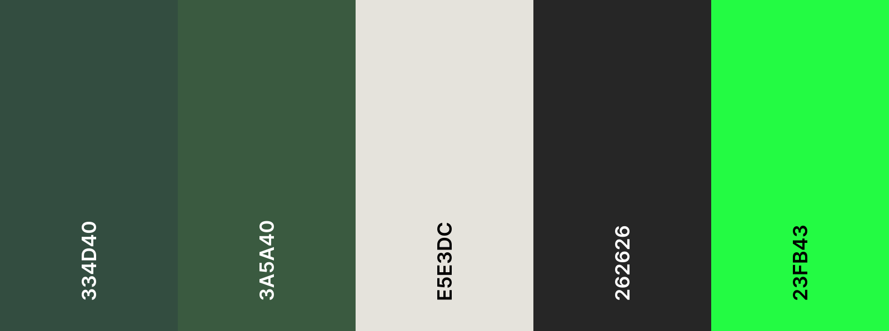

# Memory Card Game

This webpage was developed for the Milestone 2, where I have developed a memory card game based on the Zelda game franchise. The page was made to create a fun and simple experience for the player. The game has a scoring system and turn counter for competitiveness. The webpage was developed with mobile first design, then for larger screens to ensure responsiveness.

## Table of contents

1. [User stories](#user-stories)
2. [Wireframes](#wireframes)
3. [UX](#UX)
4. [Features](#features)  
4.1 [Existing features](#existing-features)  
4.2 [Features left to implement](#features-left-to-implement)
5. [Technologies used](#technologies-used)
6. [Deployment](#deployment)
7. [Testing](#testing)
8. [Credits](#credits)

## User stories

### As a player ...

- ... I want to keep track of my turns.
- ... I want to keep track of how many correct matches I have.
- ... I want to be able to restart the game.
- ... I want a reward for completing the game.
- ... I want to be able to choose with how many cards to play.
- ... I want to keep a record of my scores to compare with past ones.

[Back to the top](#table-of-contents)

## Wireframes

### Mobile

### Tablet

### Desktop

[Back to the top](#table-of-contents)

## UX

### Colour Palettes

The colours I have chosen for the webpage were based on the Twilight Princess game. And for the Score Display, I went for a more retro looking, a black background and green fonts, trying to imitate a screen.

### Readability & Accessibility
I used [webaim](https://webaim.org/resources/contrastchecker/) to check the font colour contrast for accessibility

### Typography
For the title of the page, I went for [Overlock SC](https://fonts.google.com/specimen/Overlock+SC), as it looked like a font used in the game.

The Score Display, I wanted something more retro, and the [Silkscreen](https://fonts.google.com/specimen/Silkscreen) is pixelated.

For regular text, I went for a curvy font [Fredoka](https://fonts.google.com/specimen/Fredoka).

[Back to the top](#table-of-contents)

## Features

### Existing features

- Instructions panel, for players who do not know how to play.

- Cards with flipping effect. It gives a nice feedback to the player when selecting the card.

- Turn counter, so the player knows how many turns has taken, and in the future, it will be recorded.

- Matched cards counter, so the player knows how many correct matches.

- Button to reset the game, if the player is not happy with the game stats and wants to try again.

- Congratulation message when completing the game, later I want to add best scores to this screen so the player can compare performances.

- Being able to install as an app on the phone (Only tested on Android)

[Back to the top](#table-of-contents)

### Features left to implement

- For desktop users, being able to choose how many cards to play with.
- Keep records of the past scores

[Back to the top](#table-of-contents)

## Technologies used

### Languages used

- HTML
- CSS
- JavaScript

### Frameworks, libraries, & programs used

- Favicons - [realfavicongenerator](https://realfavicongenerator.net/)
- Wireframes - [Balsamiq](https://balsamiq.com/)
- Contrast Checker - [Webaim](https://webaim.org/resources/contrastchecker/)
- Colour palette - [Coolors](https://coolors.co/)
- Fonts - [Google Fonts](https://fonts.google.com/)
- Coding - [VS Code](https://code.visualstudio.com/)

[Back to the top](#table-of-contents)

## Deployment

### To deploy a page on GitHub follow the steps below:

1. Create a public repository.
2. Log into Github.
3. From the list of repositories select the repository.
4. Navigate to the Settings tab.
5. On the left menu go to Pages.
6. Choose the main branch for deployment, and click on save.
7. On the code tab, click on the engine icon next to about.
8. Under the website input, check the option Use your GitHub Pages website.
9. Save the changes, and the link to the deployed webpage should appear.
10. This is the [link](https://faelf.github.io/MemoryCardGame/) to the live page.

### To make a local copy follow the steps below:

1. Go to the Github Repository page.
2. Find the CODE dropdown menu.
3. Click on Download as Zipfile.
4. Go to the downloaded place.
5. Open.

[Back to the top](#table-of-contents)

## Testing

User testing (manual testing) means a person checks the website by using it like the user, clicking buttons, testing all of the logic.

Automated testing uses code to run tests automatically. And Test-Driven Development (TDD) is when tests are written first, before the code. Then build the code to pass those tests.

Manual testing was used in this project, I first wrote the code, then I saw the result, and fixed problems when they appeared. It was easier for me to write the code and test its functionality using console.log than using [Jest](https://jestjs.io/).

- [Markup Validation Service](https://validator.w3.org/#validate_by_input)

The trailing slash on void elements errors, I did not know what that meant, so I googled this error, and found out the closing / was not needed, so I removed them.

And to fix the lack of heading, I changed the section tags into div.

This was the result after correcting the warnings

- [CSS Validation Service](https://jigsaw.w3.org/css-validator/#validate_by_input)

- [JavaScript](https://www.jslint.com/)

The problems highlighted by JSLint were at first simple to fix by following the suggestions provided. But after resolving the first set of issues and then running the tool again, new warnings appeared.

One error that proved difficult to correct was the 80-character line length, specifically on line 20 where I stored the card images. The issue was with the alt attributes, which contained game names. I attempted to break the line in numerous ways, but JSLint would say that the order of object properties were incorrect. Finally, I shortened the alt names to just Zelda, so that the entire line would be short enough for the 80-character limit.

JSlint also told me to replace the For loops, so I changed them to while loops.

The two errors below, on the day I was fixing the warnings I had a session with my mentor, Rory, and he helped me saying that I could just tick the broswer and indent2 options to fix the errors below.

These were the options I used to get a 0 warnings

- [PageSpeed Insights](https://pagespeed.web.dev/)

#### Mobile

#### Desktop

I had the same message on both for accessibility

After adding the alt attributes

.png)

.png)

[Back to the top](#table-of-contents)

#### Second test

After adding the instructions to footer, I ran another test, and the results were the same for Mobile and Desktop

## Credits

- **Favicon Image**
- https://www.svgrepo.com/svg/236400/game-console-gamer
- **Card images**
- https://www.ign.com/games/the-legend-of-zelda-majoras-mask
- https://www.ign.com/games/the-legend-of-zelda-a-link-to-the-past
- https://www.ign.com/games/the-legend-of-zelda-the-wind-waker
- https://www.ign.com/games/the-legend-of-zelda-twilight-princess
- https://www.ign.com/games/the-legend-of-zelda-links-awakening
- https://www.ign.com/games/the-legend-of-zelda-echoes-of-wisdom
- https://www.reddit.com/r/zelda/comments/1d3jree/-oot_what_is_the_ocarina_of_time_made_of/
- **Modal Popup**
- https://www.youtube.com/watch?v=TAB_v6yBXIE&t=260s

[Back to the top](#table-of-contents)